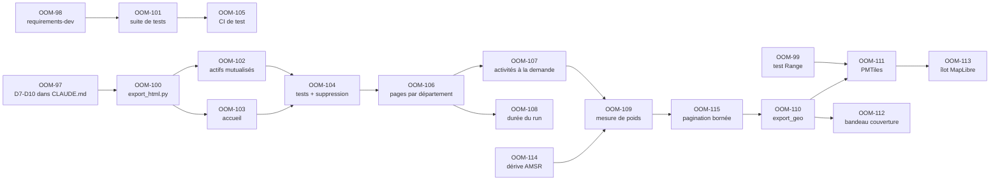

# OOMS — Plan d'orchestration de la refonte du front

Fichier destiné à l'agent orchestrateur Orca. Il ne contient pas les spécifications :
celles-ci vivent dans Linear, une par issue. Il contient l'ordre, les règles de worktree
et les points de coordination.

- **Dépôt** : `mThorlak/observatoire-offre-medicosociale-enfance`
- **Linear** : équipe `OOMS` (clé `OOM`), projet `OOMS`
- **Épopées créées** : OOM-93, OOM-94, OOM-95, OOM-96 — 17 issues au départ, plus deux nées en cours
  de route : OOM-114 (dérive de source) et OOM-115 (découpage sous D9)
- **État au 29/09/2026** : vagues 0 à 6 fusionnées. **Site en ligne** sur
  https://mthorlak.github.io/observatoire-offre-medicosociale-enfance/ (OOM-55, OOM-116).
  Priorité en cours : fiabiliser la publication (OOM-54, OOM-117) ; les vagues 7 à 9
  viennent ensuite (voir section 10)

---

## 1. Règle de répartition

| Où | Quoi |
| --- | --- |
| `CLAUDE.md` | Les invariants. Un agent qui ne lit que ce fichier doit connaître ses garde-fous. |
| Linear | L'exécution. Périmètre, critères d'acceptation, contrat, commande de vérification. |
| Ce fichier | L'ordre et la mécanique de worktree. Rien d'autre. |

**Aucun agent ne démarre sans issue Linear.** Une rubrique vide dans une issue
(périmètre, critères d'acceptation, vérification) signifie ticket non prêt : ne pas
ouvrir de worktree, demander l'arbitrage.

---

## 2. Protocole de worktree

Un agent, une issue, un worktree, une branche. Jamais deux agents dans le même checkout :
le dépôt porte déjà deux branches orphelines `worktree-agent-*` contenant des
réimplémentations indépendantes et abandonnées d'OOM-11 et OOM-12.

### Création

Linear a déjà calculé le nom de branche de chaque issue. **L'utiliser tel quel** : c'est ce
qui fait que la PR se rattache automatiquement à l'issue et la ferme à la fusion.

```bash
orca worktree create --name oom-<n> --repo path:<racine du dépôt> --base-branch origin/main \n  --linear-issue OOM-<n> --no-parent --agent claude --prompt "<brief>"
git -C <worktree> branch -m <gitBranchName de l'issue>   # avant le premier commit
```

`orca worktree create` n'a pas d'option `--branch` : avec `--linear-issue`, il nomme la
branche `mThorlak/oom-<n>`. Il faut donc la renommer, sinon la PR ne se rattache pas à
l'issue. Un long `--prompt` peut rester dans le champ de saisie de l'agent : lire le
terminal (`orca terminal read`) et renvoyer un Enter seul si l'agent n'a pas démarré.

### Base de branche

- Issue sans bloqueur → `--base-branch main`
- Issue bloquée par une autre → `--base-branch` = la branche du bloqueur **si elle n'est pas
  encore fusionnée**, sinon `main` après fusion. Préférer attendre la fusion : une base
  mouvante coûte plus cher qu'une attente.

### Fin de tâche

1. La commande de la rubrique « Vérification » de l'issue passe
2. Tous les critères d'acceptation sont cochés dans Linear
3. PR ouverte, CI verte
4. Fusion → suppression du worktree

Une issue ne se ferme pas à la main : elle se ferme par la PR qui passe sa vérification.

---

## 3. Graphe de dépendances



---

## 4. Vagues d'exécution

Chaque vague est parallélisable. Une vague ne démarre pas avant que la précédente soit fusionnée.

**Vagues 0 à 6 : fusionnées** (PR #11 à #26). La vague 6 s'est allongée en cours de route :
OOM-114 a été ouverte parce que la source avait dérivé et bloquait la mesure, et OOM-115
parce que la mesure a déclenché la condition d'arrêt 3.

| Vague | Issues | Agents | Branche |
| --- | --- | --- | --- |
| 0 | OOM-97, OOM-98, OOM-99 | 3 | `thomasfoch/oom-97-graver-d7-a-d10-dans-claudemd`<br/>`thomasfoch/oom-98-introduire-requirements-devtxt`<br/>`thomasfoch/oom-99-verifier-le-support-des-requetes-range-par-lhebergeur` |
| 1 | OOM-100, OOM-101 | 2 | `thomasfoch/oom-100-poser-export_htmlpy-et-les-gabarits-de-base`<br/>`thomasfoch/oom-101-rendre-la-suite-de-tests-executable-dun-coup` |
| 2 | OOM-102, OOM-103, OOM-105 | 3 | `thomasfoch/oom-102-mutualiser-css-et-ilots-js-dans-frontactifs`<br/>`thomasfoch/oom-103-generer-la-page-daccueil-du-site`<br/>`thomasfoch/oom-105-ajouter-la-ci-de-test-sur-push-et-pull-request` |
| 3 | OOM-104 | 1 | `thomasfoch/oom-104-couvrir-export_html-par-des-tests-et-retirer-les-html-ecrits` |
| 4 | OOM-106 | 1 | `thomasfoch/oom-106-pre-rendre-une-page-par-departement` |
| 5 | OOM-107, OOM-108 | 2 | `thomasfoch/oom-107-charger-les-activites-a-la-demande-jamais-en-bloc`<br/>`thomasfoch/oom-108-tenir-la-limite-de-dix-minutes-du-run-de-publication` |
| 6 | OOM-114 → OOM-109 → OOM-115 | 1 à la fois | `thomasfoch/oom-114-absorber-la-derive-asmr-amsr-du-connecteur-finess-activites`<br/>`thomasfoch/oom-109-mesurer-le-poids-du-site-sur-extrait-complet`<br/>`thomasfoch/oom-115-decouper-plus-finement-les-pages-departementales-et` |
| 7 | OOM-110 | 1 | `thomasfoch/oom-110-exporter-le-geojson-des-etablissements-export_geopy` |
| 8 | OOM-111, OOM-112 | 2 | `thomasfoch/oom-111-generer-larchive-pmtiles-en-ci`<br/>`thomasfoch/oom-112-afficher-le-bandeau-de-couverture-sur-chaque-carte` |
| 9 | OOM-113 | 1 | `thomasfoch/oom-113-poser-lilot-maplibre-et-le-gabarit-carte` |

### Collision en vague 0 — que Linear ne voit pas

OOM-97 et OOM-98 modifient toutes deux `CLAUDE.md`. Aucun lien de blocage ne les relie dans
Linear, pourtant deux agents y écriraient en même temps. **Lancer OOM-98 après la fusion
d'OOM-97**, pas en parallèle. OOM-99 ne touche que `docs/08_SOURCES_DONNEES.md` : elle part
immédiatement, sans attendre.

### Pourquoi OOM-104 est seule en vague 3

OOM-102, OOM-103 et OOM-104 touchent toutes `src/export_html.py` et `front/gabarits/`.
Les faire en parallèle produit des collisions garanties sur les mêmes fichiers. OOM-104
supprime en outre les deux anciens HTML : elle doit voir l'état final des deux autres.
OOM-105 reste en vague 2 car elle ne touche que `.github/workflows/`.

---

## 5. Contrats à figer avant parallélisation

Deux points où un agent aval doit développer contre un stub plutôt que réimplémenter l'amont.

**Contrat A — rendu (posé par OOM-100, consommé par OOM-102, OOM-103, OOM-104)**

```python
export_html.rendre(entrepot, dossier_gabarits, dossier_sortie) -> dict
```

Retourne un dictionnaire de compteurs sur le modèle de `export_front.exporter` :
pages écrites, lignes non résolues, millésime.

**Contrat B — chemins (posé par OOM-106, consommé par OOM-107, révisé par OOM-115)**

La référence est le tableau « Contrat B » de `CLAUDE.md` ; ne pas le recopier ici. En
résumé : `departement/<code>.html` est le sommaire des sous-pages
`departement/<code>/<n>.html`, qui portent au plus `LIGNES_PAR_SOUS_PAGE` = 1 000
établissements. Les fragments d'activités sont dans `donnees/activites/<code>/<n>.json`,
un par sous-page, et l'indicateur est en `indicateur/<code>.html`.

OOM-106 le disait figé. Il a changé une fois, sur arbitrage de l'utilisateur, parce que la
mesure réelle violait D9. Toute nouvelle révision passe par le même chemin : mesure, puis
arbitrage, puis mise à jour de `CLAUDE.md`.

---

## 6. Point de coordination : recouvrement avec OOM-47

L'épopée **OOM-47 « Mise en ligne publique de l'observatoire (couche 4 + site statique) »**
existait déjà, avec huit sous-tickets. Trois d'entre eux recoupent cette refonte. Aucun
doublon n'a été créé — voici la cartographie.

| Issue existante | Recouvrement | Traitement |
| --- | --- | --- |
| OOM-53 « Export front restreint au périmètre et format compact » | Le « format compact » est la minification JSON | Garder OOM-53 pour la restriction au périmètre. La minification peut y rester. |
| OOM-54 « Workflow GitHub Pages : construction mensuelle sur millésime figé » | Est la chaîne de publication entière | OOM-54 était encore en Backlog quand OOM-108 a démarré. **OOM-108 a donc créé `pages.yml`, l'unique workflow de publication** (#22) ; OOM-54 l'ajustera (millésime figé, `schedule`, `qualifier`) sans jamais en créer un second. Le job `deployer` ne tourne que si la variable de dépôt `PAGES_ACTIVE` vaut `true`, et c'est OOM-55 qui la posera. |
| OOM-55 « Activation de Pages, mentions de source, licence, citabilité » | La mention de licence | OOM-55 garde licence et citabilité ; OOM-103 porte la mention de périmètre sur l'accueil. Réparti explicitement dans les deux issues. |
| OOM-40 « Stratégie géospatiale sans dépendance : WKT + R*Tree » | Géospatial côté entrepôt | Distinct : OOM-40 est couche 2, OOM-110 est couche 6. Se coordonner si les deux avancent. |

### Décision prise — stratégie A, arbitrée le 19/09/2026

OOM-53 subordonne l'export front à la qualification de périmètre (couche 4 : OOM-48 à
OOM-52). Deux stratégies étaient possibles :

- **A — publier tôt.** Mettre en ligne le comptage brut avec une mention de périmètre
  explicite sur l'accueil, et qualifier ensuite. Valide la chaîne de publication avant
  d'y empiler de la logique métier.
- **B — publier juste.** Attendre la couche 4 pour ne rien publier qui puisse être lu
  comme « l'offre enfance » alors que c'est un comptage médico-social brut.

**A est retenue.** La refonte ne dépend donc pas de la couche 4 et se déroule sans
interruption de la vague 0 à la vague 9.

**La contrepartie est non négociable** : la mention de périmètre d'OOM-103 est ce qui
rend A acceptable. Sans elle, le site publie un comptage médico-social brut sous une
bannière d'observatoire enfance. C'est une condition d'arrêt, pas un détail de rédaction
— voir section 10.

Pour revenir à B : placer les vagues 0 à 9 après la couche 4 et réécrire OOM-103. Rien
d'autre ne change.

---

## 7. Les dix invariants

D1 à D6 sont déjà dans `CLAUDE.md`. D7 à D10 y entrent par OOM-97, qui est donc la
première issue de tout le plan.

| # | Principe |
| --- | --- |
| D1 | Entrepôt SQLite entre ingestion et analyse, jamais de chargement intégral en mémoire |
| D2 | Modèle pivot indépendant des sources |
| D3 | Séparation stricte lu / calculé |
| D4 | Nomenclatures, taxonomie et périmètre sont des données versionnées, jamais du code |
| D5 | Provenance sur chaque ligne (`id_lot`) |
| D6 | Aucun échec silencieux |
| D7 | Le front est une restitution, pas une application |
| D8 | Aucune donnée générée n'est versionnée |
| D9 | Budget de charge utile : 500 Ko par page au chargement initial |
| D10 | Le JavaScript est un îlot, jamais le socle |

Chaque issue Linear liste les principes qui la contraignent, sous « Principes applicables ».

---

## 8. Chiffres de référence

Mesurés sur le dépôt et sur l'échantillon versionné (millésime 202607). Un agent qui
obtient des valeurs très différentes doit s'arrêter et signaler.

| Mesure | Valeur |
| --- | --- |
| Échantillon | 1 753 établissements, 3 660 activités sur 1 616 établissements |
| `etablissements.json` | 549 Ko |
| `activites.json` | 1,50 Mo |
| `indicateur.json` | 64 Ko |
| Charge utile totale | 2,1 Mo, chargés en bloc au démarrage |
| Échelle réelle (commentaires de `schema.py`) | 174 508 établissements, 278 615 adresses |
| Extrapolation sans découpage | ~55 Mo et ~150 Mo |
| Couverture géographique | 1 142 / 2 000 adresses d'établissement, soit 57,1 % |
| `score_ban` | 1,0 pour 1 048 ; ≥ 0,8 pour la totalité des géocodés |
| Duplication CSS | 9 des 13 sélecteurs d'`indicateur.html` sont dans `liste.html` |

**Échelle réelle, mesurée le 27/09/2026** sur les extraits complets du même jour (millésime
202609), par OOM-108, OOM-114 et OOM-115. Le rapport de référence est `mesures/poids_site.md`.

| Mesure | Valeur |
| --- | --- |
| Entrepôt | 174 821 établissements, 590 440 activités, 5 290 255 lignes, ~670 Mio |
| `cli.py charger` / `integrite` | ~2 à 3 min chacun, RSS < 100 Mio |
| Run de publication (`pages.yml`) | `charger` 2 min 53 s, `rendre` 21 s |
| Site après OOM-115 | 434 pages, aucune au-delà de 500 Ko ; la plus lourde est `departement/35/3.html`, 410 Ko (40 Ko en gzip) |
| Sous-pages départementales | 225, médiane 368 Ko |
| Fragments d'activités | 225, médiane 335 Ko, max 711 Ko, chargés à la demande donc hors budget |
| Avant découpage (pour mémoire) | `departement/59.html` 6,7 Mo avant OOM-107, puis 2,98 Mo ; `indicateur.html` 2,1 Mo |

### Piège de schéma, à ne pas rater

Dans la table `adresse`, les noms mentent :

- `coordonnee_x` = **longitude** WGS84, `coordonnee_y` = **latitude** WGS84 → à utiliser
- `direction_latitude` / `direction_longitude` = **Lambert 93** malgré leur nom → à ignorer côté carte

Exemple réel : `coordonnee_x = 2.829017`, `coordonnee_y = 50.442721` (Pas-de-Calais).

---

## 9. Commandes utiles

```bash
export PYTHONPATH=src
export PYTHONIOENCODING=utf-8   # sinon UnicodeEncodeError sur les accents

# Chaîne complète sur l'échantillon versionné
python src/cli.py charger base.sqlite \
  tests/echantillon/finess-structures-mensuel-202607-echantillon_json.gz \
  --activites tests/echantillon/finess-activites-mensuel-202607-echantillon_json.gz --creer
python src/export_front.py base.sqlite --sortie front/data

# Avant toute ingestion d'un nouveau millésime
python scripts/recensement.py <fichier>

# Site, puis mesure du budget D9 (code de retour 0 attendu)
python src/export_html.py base.sqlite --sortie site/
python mesures/poids_site.py site/ --rapport mesures/poids_site.md

# Toute la suite de tests (OOM-101)
python tests/tout.py
```

---

## 10. Séquencement autonome

La stratégie A étant arbitrée (section 6), Orca déroule le plan seul, de la vague 0 à la
vague 9, sans demander d'arbitrage — sauf condition d'arrêt ci-dessous.

### État au 29/09/2026

| Issue | État | Action |
| --- | --- | --- |
| OOM-97 à OOM-109, OOM-114, OOM-115 | Fusionnées | — |
| OOM-55, OOM-116 | Fusionnées (`main` = `c870f33`) : site public en ligne | — |
| OOM-54 | En cours : millésime mensuel figé, `schedule` | Contrôler, fusionner, relancer `pages.yml` |
| OOM-117 | En cours : 40 codes de catégorie absents du référentiel | Contrôler, fusionner, relancer `pages.yml` |
| OOM-110 | Backlog, débloquée par OOM-115 | Vague 7, après OOM-54 et OOM-117 |
| OOM-111 à OOM-113 | Backlog | Selon la boucle |

**Mise en ligne, 29/09/2026.** Priorité choisie par l'utilisateur : publier vite. Pages est
passé en `build_type=workflow` et `PAGES_ACTIVE=true` ; le site est construit par
`pages.yml` depuis `main` (run 36622600318, millésime 202609). Le premier déploiement
affichait « millésime inconnu », parce que le workflow renommait les extraits : OOM-116 l'a
corrigé et rend un millésime inconnu bloquant. La branche jetable `gh-pages-test` (OOM-99)
et les branches fusionnées ont été supprimées. Pages sert les fichiers compressés en gzip.

**Publication = action de l'orchestrateur.** Après chaque fusion qui change le rendu,
relancer `gh workflow run pages.yml --ref main`, suivre le run, puis vérifier par `curl`
l'accueil (millésime, mention de périmètre, pied de page) et quelques pages profondes. Ne
jamais publier depuis une autre branche : `deployer` est sauté hors `main`.

### La boucle

Pour chaque vague du tableau de la section 4, dans l'ordre :

1. Vérifier que **toutes** les issues de la vague précédente sont fusionnées dans `main`
2. Pour chaque issue de la vague : créer son worktree et renommer sa branche (section 2)
3. Lancer un agent par worktree. Contexte à lui donner, dans cet ordre : l'issue Linear,
   `CLAUDE.md`, ce fichier. Rien d'autre — un agent qui lit tout `docs/architecture/`
   pour ajouter un gabarit gaspille son contexte.
4. Passer l'issue en `In Progress` dans Linear au démarrage de l'agent
5. Attendre les trois conditions : CI verte, tous les critères d'acceptation cochés,
   commande de la rubrique « Vérification » exécutée et concluante
6. Ouvrir la PR, fusionner, supprimer le worktree — l'issue se ferme d'elle-même
7. Mettre à jour le graphe graphify : ramener sur `main` le checkout qui porte `graphify-out/`,
   puis `/graphify . --update` (voir la section graphify de `CLAUDE.md`). Une fois par vague,
   pas par issue ; jamais dans un worktree d'issue
8. Vague suivante

Une vague n'est finie que quand **toutes** ses issues sont fusionnées. Pas de chevauchement
entre vagues : c'est ce qui garantit qu'aucun agent ne travaille sur une base périmée.

### Conditions d'arrêt — Orca s'arrête et demande

1. **Une vérification échoue deux fois de suite** sur la même issue. Un échec, on corrige ;
   deux, c'est que la spécification est fausse.
2. **OOM-99 conclut que les requêtes Range ne sont pas honorées.** OOM-111 change alors de
   cible : l'archive part sur un stockage objet dédié, ce qui est un choix d'hébergement,
   pas une décision d'agent.
3. **OOM-109 mesure une page au-delà de 500 Ko.** D9 est violé : le découpage doit être
   revu avant d'aller plus loin, jamais toléré.
4. **Avant de lancer OOM-106** : vérifier que la mention de périmètre d'OOM-103 est
   effectivement en place dans `site/index.html`. Absente → arrêt immédiat. C'est la
   contrepartie de la stratégie A.
5. **OOM-108 et OOM-54.** Si OOM-54 est en cours ou fusionnée, OOM-108 devient un
   ajustement de ce workflow. Ne jamais créer un second workflow de publication.
6. **Conflit de fusion touchant** `CLAUDE.md`, `src/schema.py` ou
   `docs/architecture/03_SCHEMA_PIVOT.md`. Ces trois fichiers portent des décisions, pas
   du code ordinaire.
7. **Une rubrique du gabarit est vide** dans une issue : ticket non prêt, pas de worktree.

### Ce qui ne demande pas d'arbitrage

- Un conflit de fusion trivial sur un fichier de code
- Un test à ajuster parce que la sortie a légitimement changé
- Le choix entre les deux options d'OOM-101 : prendre l'option 1, l'agrégateur stdlib,
  et écrire le motif dans `CLAUDE.md`
- Le nommage interne des fonctions et des gabarits, tant que les contrats de la section 5
  sont respectés

## 11. Ce qu'Orca ne fait pas

- Ne crée pas d'issue sans y mettre les sept rubriques du gabarit
- Ne fusionne pas une PR dont la commande de vérification n'a pas été exécutée
- Ne tranche pas la stratégie A / B de la section 6
- Ne modifie pas `requirements.txt` — les dépendances de développement vont dans
  `requirements-dev.txt`, jamais importées par `src/`
- Ne supprime pas `tests/echantillon/` : c'est l'exception explicite du `.gitignore`
- N'invente jamais un libellé pour un code hors référentiel — il se signale, il ne se tait pas
